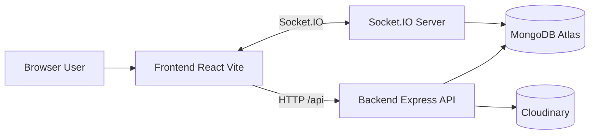

# 01 - Overall Architecture Diagram

```mermaid
flowchart LR
    U[Browser User]
    FE[Frontend React Vite]
    API[Backend Express API]
    WS[Socket.IO Server]
    DB[(MongoDB Atlas)]
    CLD[(Cloudinary)]

    U --> FE
    FE -->|HTTP /api| API
    FE <-->|Socket.IO| WS
    API --> DB
    API --> CLD
    WS --> DB
```
