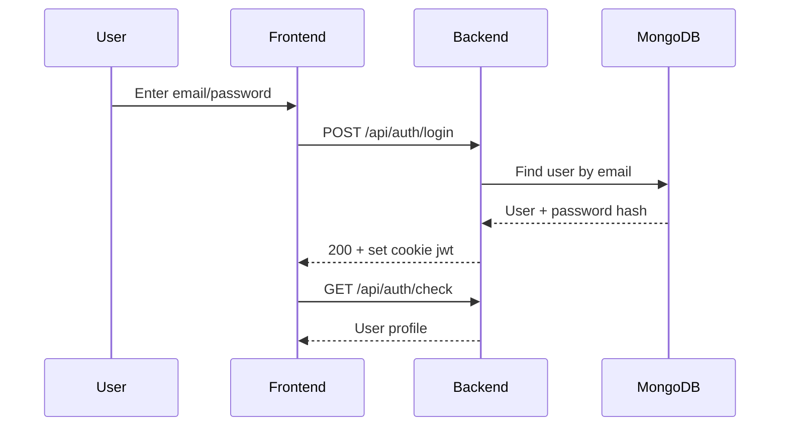

# 03 - Login Sequence

```mermaid
sequenceDiagram
    participant U as User
    participant FE as Frontend
    participant BE as Backend
    participant DB as MongoDB

    U->>FE: Enter email/password
    FE->>BE: POST /api/auth/login
    BE->>DB: Find user by email
    DB-->>BE: User + password hash
    BE-->>FE: 200 + set cookie jwt
    FE->>BE: GET /api/auth/check
    BE-->>FE: User profile
```
