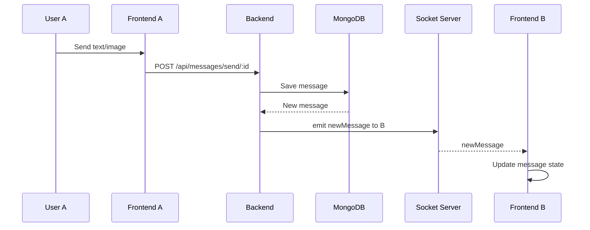

# 04 - Realtime Message Sending Sequence

```mermaid
sequenceDiagram
    participant A as User A
    participant FEA as Frontend A
    participant BE as Backend
    participant DB as MongoDB
    participant WEB as Socket Server
    participant FEB as Frontend B

    A->>FEA: Send text/image
    FEA->>BE: POST /api/messages/send/:id
    BE->>DB: Save message
    DB-->>BE: New message
    BE->>WEB: emit newMessage to B
    WEB-->>FEB: newMessage
    FEB->>FEB: Update message state
```
