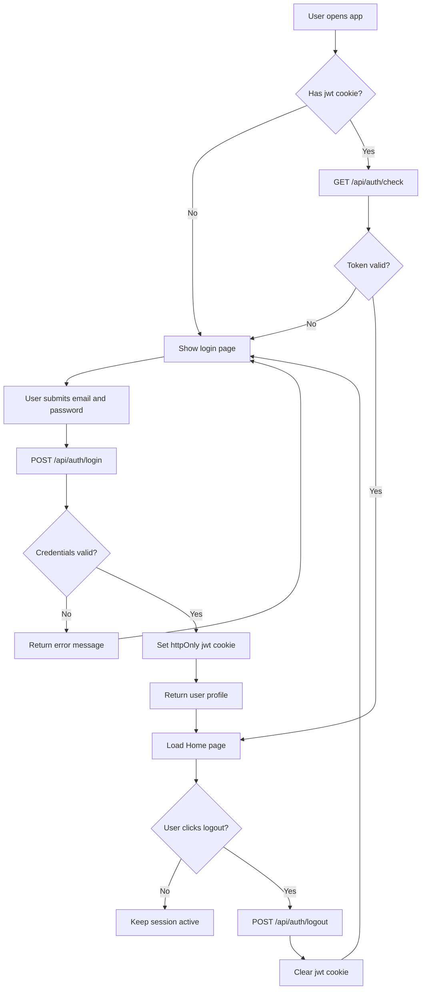

# 06 - Auth Activity Diagram

```mermaid
flowchart TD
    A[User opens app] --> B{Has jwt cookie?}

    B -->|No| C[Show login page]
    C --> D[User submits email and password]
    D --> E[POST /api/auth/login]
    E --> F{Credentials valid?}
    F -->|No| G[Return error message]
    G --> C
    F -->|Yes| H[Set httpOnly jwt cookie]
    H --> I[Return user profile]

    B -->|Yes| J[GET /api/auth/check]
    J --> K{Token valid?}
    K -->|No| C
    K -->|Yes| L[Load Home page]

    I --> L
    L --> M{User clicks logout?}
    M -->|No| N[Keep session active]
    M -->|Yes| O[POST /api/auth/logout]
    O --> P[Clear jwt cookie]
    P --> C
```
