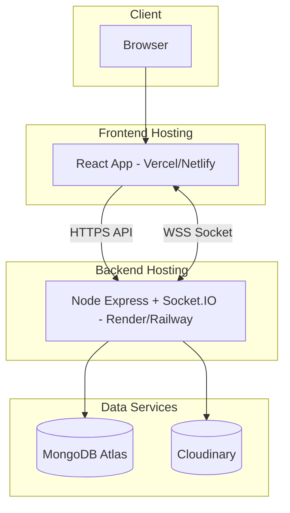

# 05 - Deployment Diagram

```mermaid
flowchart TB
    subgraph Client
      BROWSER[Browser]
    end

    subgraph Frontend Hosting
      FE[React App - Vercel/Netlify]
    end

    subgraph Backend Hosting
      BE[Node Express + Socket.IO - Render/Railway]
    end

    subgraph Data Services
      MDB[(MongoDB Atlas)]
      CLD[(Cloudinary)]
    end

    BROWSER --> FE
    FE -->|HTTPS API| BE
    FE <-->|WSS Socket| BE
    BE --> MDB
    BE --> CLD
```
