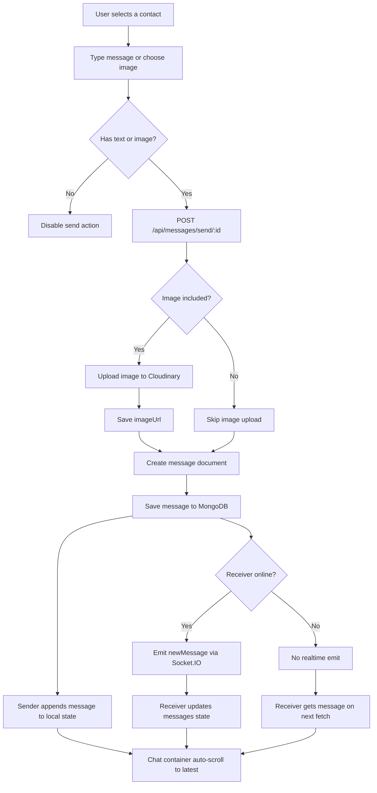

# 07 - Send Message Activity Diagram

```mermaid
flowchart TD
    A[User selects a contact] --> B[Type message or choose image]
    B --> C{Has text or image?}
    C -->|No| D[Disable send action]
    C -->|Yes| E[POST /api/messages/send/:id]

    E --> F{Image included?}
    F -->|Yes| G[Upload image to Cloudinary]
    G --> H[Save imageUrl]
    F -->|No| I[Skip image upload]

    H --> J[Create message document]
    I --> J
    J --> K[Save message to MongoDB]
    K --> L{Receiver online?}

    L -->|Yes| M[Emit newMessage via Socket.IO]
    L -->|No| N[No realtime emit]

    M --> O[Receiver updates messages state]
    N --> P[Receiver gets message on next fetch]

    K --> Q[Sender appends message to local state]
    Q --> R[Chat container auto-scroll to latest]
    O --> R
    P --> R
```
